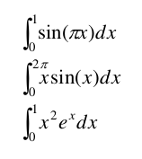

# Numerical Method

### Task 15.1
Find approx varaibles a and b for function below:

 

with data in a table

| i | |  |
|-|:-:|:-|
| 1 | 1.00 | 5.10
| 2 | 1.25 | 5.97
| 3 | 1.50 | 6.53
| 4 | 1.75 | 7.45
| 5 | 2.00 | 8.46

### Task 15.2

Find positive root function: 

 

with Netwon method. Start from x = 3.14. 

### Task 15.3

Calculate the Integral of:

Using: Rectangular integration, Trapezoidal rule and Simpson's Rule.

## Technologies
* C++20
